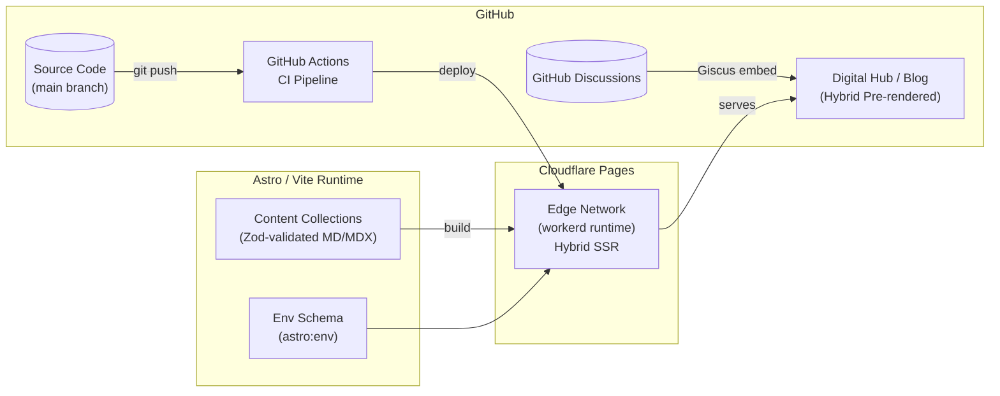

# kautilya.pro

> _The architecture of the unseen. Code, Chaos, and the pursuit of underlying systems._

The personal blog of **Kautilya Bhardwaj** — Systems Architect, 10+ YoE. Built in public as a living artifact of engineering practice.

[](https://github.com/kautilya-pro/site/actions/workflows/ci.yml)

---

## Architecture



### Design Principles

| Principle                     | Implementation                                                                            |
| ----------------------------- | ----------------------------------------------------------------------------------------- |
| **Zero operational overhead** | No databases, no backend. Comments via Giscus (GitHub Discussions).                       |
| **Edge-first / Hybrid**       | Cloudflare Pages `workerd` with `output: "server"`. Content is pre-rendered for speed.    |
| **Build-time correctness**    | Zod schemas validate every frontmatter field. Malformed content fails CI, not production. |
| **Near-zero client JS**       | No framework JS. Minimal inline JS for ToC scroll-spy. Giscus/GA load via Partytown.      |

### Image Architecture

- **Asset Relocation**: UI assets (avatars, logos) are stored in `src/assets/`, bypassing the unoptimized `public/` directory.
- **Markdown Co-location**: Blog post images are co-located within `src/content/blog/` folders to leverage Astro's relative path optimization.
- **astro:assets**: The project uses Astro's `<Image />` component (e.g., on the homepage) for native optimization, preventing layout shift.

> **IMPORTANT**: Cloudflare Image Resizing is enabled via the `@astrojs/cloudflare` adapter (`imageService: "cloudflare"` in prod).

---

## Tech Stack

| Layer     | Technology                                       | Version                  |
| --------- | ------------------------------------------------ | ------------------------ |
| Framework | [Astro](https://astro.build)                     | `6.x` (beta)             |
| Bundler   | [Vite](https://vite.dev)                         | `7.x`                    |
| Hosting   | [Cloudflare Pages](https://pages.cloudflare.com) | `workerd` edge (Hybrid)  |
| Styling   | [Tailwind CSS](https://tailwindcss.com)          | `4.x`                    |
| Content   | MDX support                                      | `@astrojs/mdx`           |
| Comments  | [Giscus](https://giscus.app)                     | GitHub Discussions       |
| Analytics | Google Analytics                                 | via `@astrojs/partytown` |

---

## Local Development

**Prerequisites**: Node.js ≥ 22.12.0

```bash
# Clone and install
git clone https://github.com/kautilya-pro/site.git
cd site
npm ci

# Environment Setup
cp .env.example .env # Configure Giscus & GA keys

# Development server (http://localhost:4321)
npm run dev

# Production build (validates Cloudflare Pages output)
npm run build

# Type & schema validation
npm run astro:check
```

### Commands

| Command               | Action                               |
| --------------------- | ------------------------------------ |
| `npm run dev`         | Start dev server at `localhost:4321` |
| `npm run build`       | Build production site to `./dist/`   |
| `npm run preview`     | Preview production build locally     |
| `npm run astro:check` | Validate types and Zod schemas       |

---

## Content Creation

All blog posts live in `src/content/blog/` as Markdown or MDX files. Every post **must** satisfy the Zod schema defined in [`content.config.ts`](src/content.config.ts):

```yaml
---
---
title: "Your Post Title" # required, string
description: "A concise summary." # required, string
date: 2026-03-08 # required, coerced to Date
updatedDate: 2026-03-08 # optional, coerced to Date
series: "systems-thinking" # required, string (URL segment)
permalinkSlug: "your-post-slug" # required, string (URL segment)
heroImage: "./hero.png" # optional, co-located image
draft: false # optional, defaults to false
---
```

**URL structure**: `/<series>/<permalinkSlug>` — e.g., `kautilya.pro/systems-thinking/your-post-slug`

Posts with `draft: true` are excluded from builds and sitemaps.

---

## Project Structure

```text
├── .github/workflows/ci.yml    # CI pipeline (Node 22, build, type-check)
├── docs/adr/                   # Architecture Decision Records
├── infrastructure/k8s/         # Peripheral microservices (CKA practice)
├── public/
│   ├── favicon.svg
│   ├── favicon.ico
│   ├── robots.txt              # Crawler directives
│   └── .assetsignore           # Cloudflare build exclusions
├── src/
│   ├── assets/                 # UI assets (Optimized via astro:assets)
│   ├── components/
│   │   ├── BaseHead.astro      # Global <head> (meta, OG, Twitter, canonical)
│   │   ├── SEO.astro           # Article-specific SEO + JSON-LD Schema
│   │   ├── TableOfContents.astro # Sticky scroll-spy navigation
│   │   ├── FormattedDate.astro
│   │   ├── Header.astro
│   │   └── Footer.astro
│   ├── content/
│   │   └── blog/               # Markdown/MDX + co-located images
│   ├── layouts/
│   │   ├── BaseLayout.astro    # Generic page layout (GA tracking)
│   │   └── BlogPost.astro      # Article layout (ToC, Giscus)
│   ├── pages/
│   │   ├── index.astro         # Digital Hub (Bio + Linktree)
│   │   ├── code-and-chaos/     # Series landing page
│   │   ├── rss.xml.ts          # RSS feed
│   │   └── [series]/[slug].astro
│   ├── styles/global.css       # Design System (Tailwind v4 tokens)
│   ├── consts.ts               # Site-wide constants
│   └── content.config.ts       # Loader-based Zod schemas
├── astro.config.mjs            # Hybrid SSR config + env schema
├── wrangler.jsonc              # Cloudflare Workers config
├── tsconfig.json
├── .env.example                # Template for Giscus/GA secrets
└── package.json
```

---

## Architecture Decision Records

| ADR                                              | Title                                               | Status   |
| ------------------------------------------------ | --------------------------------------------------- | -------- |
| [ADR-0001](docs/adr/0001-system-architecture.md) | System Architecture (Astro 6 + Cloudflare + Giscus) | Accepted |

---

## License

Content © Kautilya Bhardwaj. All rights reserved.
